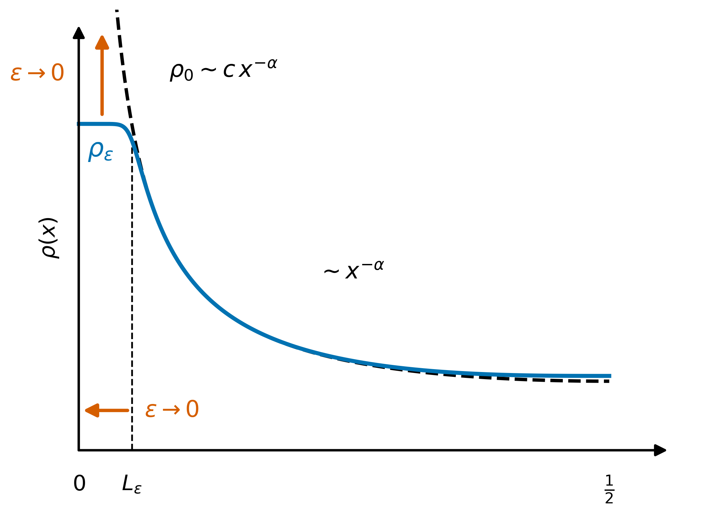
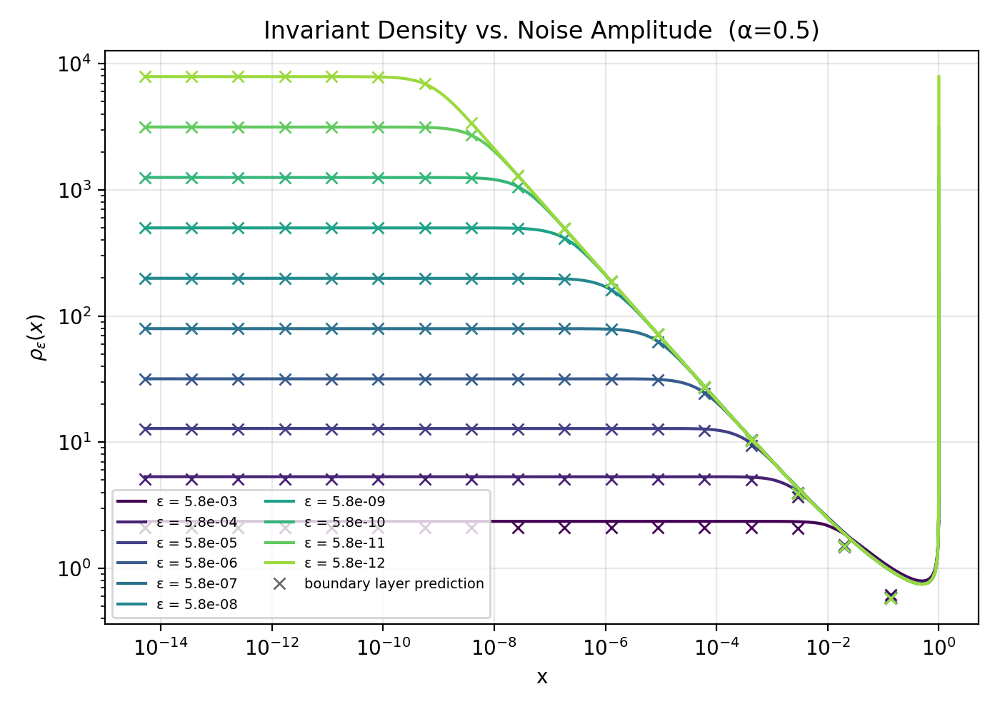
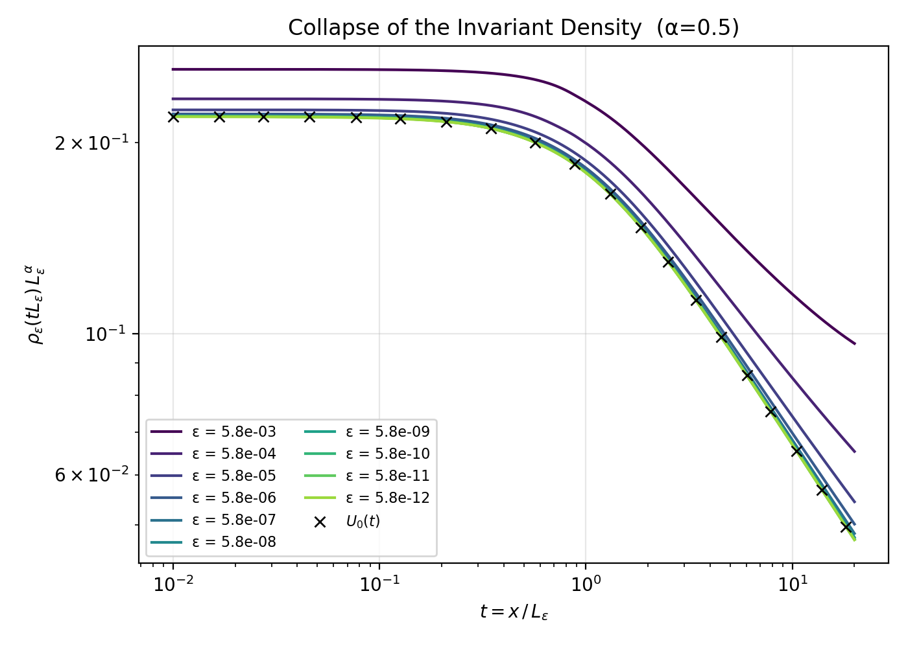
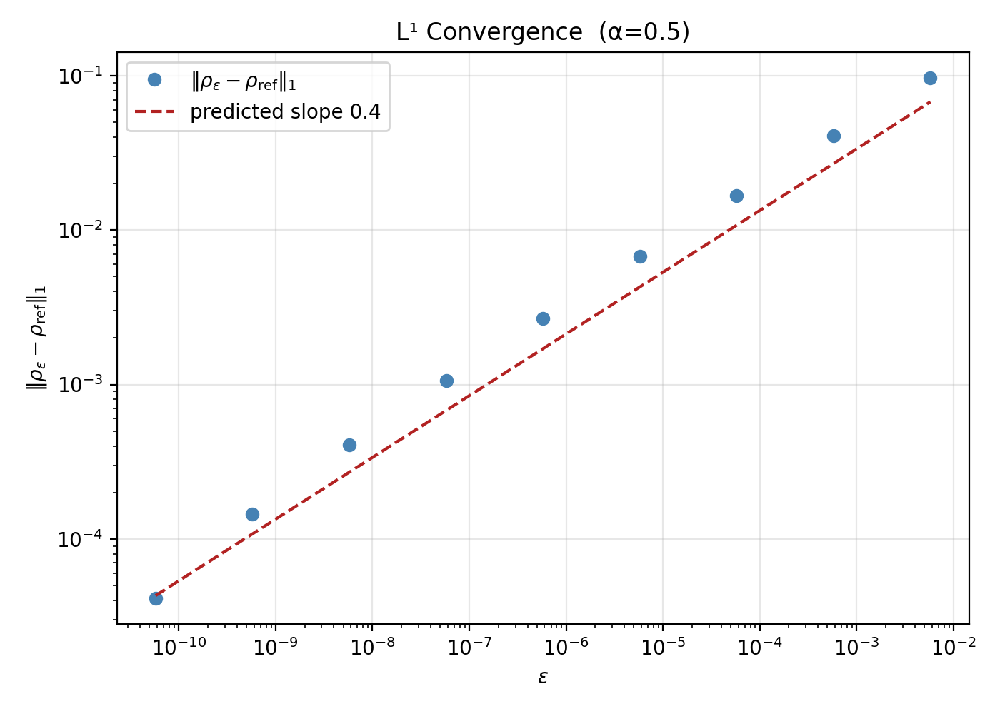
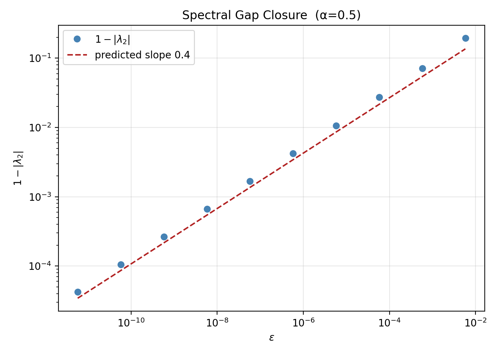
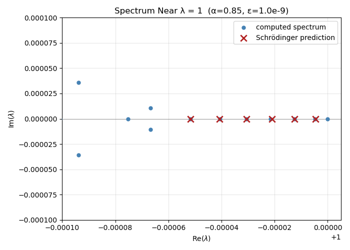

# PmSpectrum.jl

`PmSpectrum.jl` is a Julia package for computing invariant densities and spectral properties of a randomly perturbed symmetrized Pomeau–Manneville map. It was developed to numerically study the small-noise behavior of an intermittently chaotic dynamical system whose noiseless transfer operator has no spectral gap.

Maps of this kind are named after [Pomeau and Manneville (1980)](https://doi.org/10.1007/BF01197757), who introduced intermittency as a model for transitions to turbulence, characterized by long laminar episodes interrupted by irregular chaotic bursts.

The primary purpose of the package is to test predictions obtained from a formal asymptotic analysis of the small-noise problem and to generate new hypotheses. In particular, as $`\varepsilon \to 0`$, we study the shape of the noisy invariant density, its $`L^1(\mathbb{T})`$ convergence to the noiseless density, the closing of the spectral gap, and the structure of additional slow spectral modes.

The numerical method uses a nonuniform B-spline Galerkin approximation designed to resolve the shrinking spatial scales that develop near the neutral fixed point.

This code accompanies the manuscript currently in preparation:

**Benjamin Stilin**, Kevin Lin, Shankar Venkataramani. *Stationary Measures of a Randomly Perturbed Circle Map with a Neutral Fixed Point.*

---

## Contents

* [Installation](#installation)

* [Quick start](#quick-start)

* [Environments and reproducibility](#environments-and-reproducibility)

* [Model and motivation](#model-and-motivation)

* [Why study the transfer-operator spectrum?](#why-study-the-transfer-operator-spectrum)

* [Small-noise asymptotic predictions](#small-noise-asymptotic-predictions)

* [Numerical illustration of the asymptotic predictions](#numerical-illustration-of-the-asymptotic-predictions)

* [Numerical method](#numerical-method)

* [Further usage](#further-usage)

* [Precision and serialization](#precision-and-serialization)

* [Package structure](#package-structure)

* [Running tests](#running-tests)

* [Compute environment](#compute-environment)

* [Use of AI assistants](#use-of-ai-assistants)

* [References](#references)

* [Citation](#citation)

---

## Installation

This package is not registered in the Julia General Registry. It can be installed directly from its GitHub repository.

Open the Julia REPL and enter Pkg mode by pressing `]`:

```julia

pkg> add https://github.com/bstilin/PmSpectrum.jl

```

The package requires Julia 1.11+. Its dependencies are declared in the `Project.toml` at the repository root.

This installs the library only. The tutorial scripts are not part of the installed package, so to run those, clone the repository instead and work from the clone:

```bash

git clone https://github.com/bstilin/PmSpectrum.jl

cd PmSpectrum.jl

```

The scripts use their own environment, described under [Running the tutorial scripts](#running-the-tutorial-scripts).

---

## Quick start

### One run from the package API

A single call computes the Galerkin approximation of $`P_\varepsilon`$ and solves its eigenproblem. Everything else is a query against the returned object.

```julia

using PmSpectrum

# alpha, epsilon, num_break_points, num_quad_points

result = run_single_experiment(0.5, 1e-5, 150, 64)

# Rebuild the live BSplineKit objects from the stored result.

rh = rehydrate(result)

rh.pdf(0.3)                   # evaluate the invariant density at a point

rh.eigenvalues[1]             # ≈ 1, the stationary eigenvalue

rh.eigenvalues[2]             # leading nonstationary eigenvalue λ₂

1 - abs(rh.eigenvalues[2])    # the spectral gap

```

Four things are worth knowing before changing the numbers:

* **`epsilon` is the half-width** of the uniform noise kernel, not the paper's standard deviation. See the noise-convention note below; the two differ by $`\sqrt{3}`$.

* **`alpha` and `epsilon` must share a concrete type**, and that type is the working precision. `Float64` and `Double64` are supported; `Double64` is re-exported by `PmSpectrum`, so `run_single_experiment(Double64(0.5), parse(Double64, "1e-14"), 150, 64)` needs no extra import. Prefer `parse(Double64, "1e-14")` over `Double64(1e-14)`, which merely converts a number already rounded to `Float64`.

* **`num_break_points` is the dominant cost.** It counts breakpoints in $`[\xi,1/2]`$ of the hybrid mesh, so the basis is roughly twice that; the transfer matrix is dense, so doubling it is about 4× the assembly and 8× the eigensolve.

* **Small `epsilon` is not itself slow**, but it needs a finer basis to resolve the boundary layer, which is.

`rh.eigenvalues` is sorted by $`|\lambda|`$ descending. The full stored spectrum is also available unpacked as `result.eigenvalues_re` and `result.eigenvalues_im`, and the invariant-density spline coefficients as `result.c`.

### Running the tutorial scripts

If you would rather start from complete runnable examples, `scripts/` contains three tutorial scripts designed to be read from top to bottom and edited directly. Each begins with a parameter block, and the calculations are written at top level so the intermediate variables remain available after the script finishes and can be inspected interactively in Julia.

The scripts have their own environment, `scripts/Project.toml`, which adds `PyPlot` and picks the package up from the parent directory. After cloning the repository, instantiate this environment once from the repository root:

```bash

julia --project=scripts -e 'using Pkg; Pkg.instantiate()'

```

Then run the scripts from the repository root, for example:

```bash

julia --project=scripts scripts/tutorial_compute_invariant_density.jl

```

The initial setup may build `PyCall` and configure the Python/matplotlib backend used by `PyPlot`. After that, the environment is reused. `PmSpectrum` itself is plot-free and does not depend on `PyPlot`.

| Script | What it does |
| --- | --- |
| `tutorial_compute_invariant_density.jl` | One $`(\alpha,\varepsilon)`$ worked end to end without `run_single_experiment`: build the basis, assemble the Galerkin matrices, solve the eigenproblem, normalize the density. Then computes the Lyapunov exponent, the correlation decay of an even and an odd observable, a comparison of the real eigenvalues near 1 against the Schrödinger prediction, and the relevant reduced resolvent norm. |
| `tutorial_parameter_sweep.jl` | The batch workflow written out in the open: a grid over alpha × epsilon × precision, one JLD2 file per run written to `data/tutorial_sweep/` with the parameters encoded in the filename. Re-running skips files that already exist, so an interrupted sweep resumes. Runs in seconds for Float64. |
| `analyzing_tutorial_sweep.jl` | Reads a sweep back for one fixed alpha and precision and every epsilon, then draws seven figures into `plots/tutorial_plots/`, each as a PDF and a PNG: a density overlay, the boundary-layer collapse, the $`L^1`$ and spectral-gap scaling laws, and three views of the second eigenfunction. Run a sweep first. Four of these are reproduced and discussed under [Numerical illustration of the asymptotic predictions](#numerical-illustration-of-the-asymptotic-predictions). |

The first script is independent of the second two. The third script analyzes what the second one writes.

Note that `data/` and `plots/` are both git-ignored, so everything the scripts write stays local. The five figures reproduced in this README are kept separately, as tracked copies under `docs/figures/`.

---

## Environments and reproducibility

The repository uses two Julia environments:

* The root `Project.toml` is the package environment. Use `julia --project=.` for library work and for running the test suite.

* `scripts/Project.toml` is the scripts environment. It adds `PyPlot` and points `PmSpectrum` at the local checkout, so scripts run against the current source code.

From the repository root,

```bash

julia --project=.          # package environment

julia --project=scripts    # scripts environment

```

The tutorial and analysis scripts should be run with the scripts environment, for example,

```bash

julia --project=scripts scripts/tutorial_compute_invariant_density.jl

```

In VS Code, use the root environment for package development and the `scripts/` environment for the tutorial and plotting scripts.

`Manifest.toml` is currently git-ignored, so dependency versions are not pinned. The committed `Project.toml` files specify compatibility bounds instead. When the paper is published, a pinned environment for reproducing the reported numerical results will be provided separately.

---

## Model and motivation

### The symmetric Pomeau–Manneville map

We identify $`[0,1)`$ with the circle $`\mathbb{T}=\mathbb{R}/\mathbb{Z}`$, so that $`0\equiv1`$. For $`0<\alpha<1`$, we consider the symmetric Pomeau–Manneville map $`T_\alpha:\mathbb{T}\to\mathbb{T}`$,

```math
T_\alpha(x)=
\begin{cases}
x+2^\alpha x^{1+\alpha}, & 0\leq x<1/2,\\
x-2^\alpha(1-x)^{1+\alpha}, & 1/2\leq x<1.
\end{cases}
```

The branch on $`[0,1/2)`$ is the intermittent branch of the Liverani–Saussol–Vaienti map, introduced in [Liverani, Saussol and Vaienti (1999)](https://doi.org/10.1017/S0143385799133856). $`T_\alpha`$ is a symmetrized version of that map: its uniformly expanding branch $`2x-1`$ is replaced by the reflection of the intermittent branch, so that $`T_\alpha(1-x)=1-T_\alpha(x)`$.

The identified point $`0\equiv1`$ is a two-sided neutral fixed point: the derivative of the map there is equal to one, so trajectories sufficiently close to the fixed point escape slowly and monotonically. Away from this point the dynamics are expanding and chaotic. A typical trajectory therefore alternates unpredictably between long laminar episodes near the neutral fixed point and faster, chaotic excursions through the expanding part of the map.

This intermittency has important statistical consequences. The noiseless map has an invariant probability density $`\rho_0`$ with a power-law singularity

```math
\rho_0(x)\sim C|x|^{-\alpha}
```

near the neutral fixed point. Its transfer operator has no spectral gap, and relaxation and correlation decay are algebraic rather than exponential.

### The deterministic transfer operator

To study the statistical behavior of the map, we work with the **Perron–Frobenius operator**, also called the **transfer operator**. Rather than evolving individual points under $`T_\alpha`$, the transfer operator evolves probability densities.

For a density $`f\in L^1(\mathbb{T})`$, the deterministic transfer operator

```math
P:L^1(\mathbb{T})\to L^1(\mathbb{T})
```

is defined by the requirement that, for every measurable set $`A\subseteq\mathbb{T}`$,

```math
\int_A(Pf)(x)\,dx
=
\int_{T_\alpha^{-1}(A)}f(x)\,dx.
```

Thus, if $`f`$ describes the distribution of an ensemble of initial conditions, then $`Pf`$ describes their distribution after one application of the map. Iterating the operator gives the density after $`n`$ steps:

```math
f_n=P^n f_0.
```

The transfer operator is dual to the **Koopman operator**, which evolves observables rather than densities. For an observable $`\varphi\in L^\infty(\mathbb{T})`$, the Koopman operator is

```math
K\varphi=\varphi\circ T_\alpha.
```

The two operators satisfy the $`L^1`$-$`L^\infty`$ duality relation

```math
\int_{\mathbb{T}}(Pf)(x)\varphi(x)\,dx
=
\int_{\mathbb{T}}f(x)\varphi(T_\alpha(x))\,dx
=
\int_{\mathbb{T}}f(x)(K\varphi)(x)\,dx.
```

In this sense, the transfer operator propagates **densities forward**, while the Koopman operator propagates **observables through composition with the dynamics**.

### Random perturbations and the noisy transfer operator

We perturb the deterministic dynamics by independent additive noise,

```math
x_{n+1}=T_\alpha(x_n)+\varepsilon\xi_n \pmod 1,
```

where $`\varepsilon>0`$ controls the noise amplitude. In the accompanying paper, the random variables are independent and distributed according to the symmetric, mean-zero, unit-variance law

```math
\xi_n\sim\mathrm{Unif}[-\sqrt{3},\sqrt{3}].
```

> **Noise convention.** The paper and the code use different parameterizations of the same family of uniform noise kernels. In the paper, $`\varepsilon`$ multiplies a unit-variance random variable, so the perturbation is uniform on $`[-\sqrt{3}\varepsilon,\sqrt{3}\varepsilon]`$. In the code, `epsilon` denotes the **half-width of the uniform kernel**, so the perturbation is uniform on `[-epsilon, epsilon]`. Thus
>
> ```math
> \texttt{epsilon}_{\mathrm{code}}
> =
> \sqrt{3}\,\varepsilon_{\mathrm{paper}}.
> ```
>
> This constant rescaling does not change any of the predicted scaling exponents, but it does change the corresponding prefactors.

We define the noisy transfer operator directly in terms of the random maps generating these dynamics. For each shift $`t\in\mathbb{T}`$, define

```math
T_t(z)=T_\alpha(z)+t\pmod 1
```

and let $`P_t`$ denote the Perron–Frobenius operator associated with $`T_t`$. If $`g_\varepsilon`$ is the probability density of the additive perturbation $`\varepsilon\xi_n`$ wrapped onto the circle, then the noisy transfer operator is the average of these deterministic transfer operators weighted by the probability of each shift:

```math
P_\varepsilon f(z)
\coloneqq
\int_{\mathbb{T}}P_t f(z)\,g_\varepsilon(t)\,dt.
```

For a fixed noise realization $`t`$, the deterministic transfer operator $`P_t`$ gives the density $`P_t f(z)`$ transported to $`z`$. The noisy transfer operator averages these densities over all possible shifts $`t`$, weighted by their probability density $`g_\varepsilon(t)`$. Thus, $`P_\varepsilon f(z)`$ can be interpreted as the expected density at $`z`$ after one step of the random dynamics.

There is an equivalent and computationally useful representation. Let $`P`$ denote the Perron–Frobenius operator of the unperturbed map $`T_\alpha`$, and let $`\mathcal{G}_\varepsilon`$ denote circular convolution with the wrapped noise density $`g_\varepsilon`$. Then

```math
P_\varepsilon=\mathcal{G}_\varepsilon P.
```

In other words, a noisy transfer step can equivalently be viewed as first transporting the density under the deterministic map and then convolving the resulting density with the noise kernel on the circle.

For nonzero noise, this convolution smooths the singularity in the noiseless invariant density. The central question is what happens as $`\varepsilon\to0`$, when the regularization becomes increasingly localized and the system approaches the noiseless problem.

The spectrum of the noisy transfer operator is the central object of study for this project.

---

## Why study the transfer-operator spectrum?

The transfer operator gives a linear description of the statistical dynamics. Rather than following individual trajectories, it describes how an entire probability density evolves under repeated applications of the random map.

The eigenvalue $`1`$ represents the stationary state. Its normalized eigenfunction is the invariant density $`\rho_\varepsilon`$, satisfying

```math
P_\varepsilon\rho_\varepsilon=\rho_\varepsilon.
```

The remaining spectral data describe how perturbations away from equilibrium evolve. Roughly, a mode associated with an eigenvalue $`\lambda`$ is multiplied by $`\lambda`$ after one iteration and by $`\lambda^n`$ after $`n`$ iterations. Eigenvalues close to the unit circle therefore correspond to slowly decaying statistical structures, while eigenvalues deeper inside the unit disk correspond to faster relaxation.

Of particular interest is the leading nonstationary eigenvalue $`\lambda_2`$. Its distance from the unit eigenvalue,

```math
1-|\lambda_2|,
```

determines the spectral gap and hence the longest relaxation timescale. As the noise tends to zero, this gap is expected to close in order to recover the gapless intermittent dynamics of the noiseless map.

Computing more of the spectrum provides information beyond the invariant density and the single slowest decay rate. Additional eigenvalues and eigenfunctions describe a hierarchy of transient modes.

Accordingly, `PmSpectrum.jl` is intended for two complementary purposes:

1. **Prediction testing.** The package provides high-accuracy numerical approximations against which the small-noise predictions of the formal asymptotic theory can be tested.

2. **Hypothesis generation.** By computing spectral information beyond what is currently explained by the asymptotic theory, the package can reveal patterns such as the location, multiplicity, symmetry, and scaling of additional spectral modes that suggest new analytical questions and conjectures.

---

## Small-noise asymptotic predictions

The numerical calculations in this package are motivated by a formal asymptotic analysis of the small-noise problem developed in the accompanying paper.

The starting point is a simple feature already visible in relatively coarse numerical calculations. For nonzero noise, the singularity of the noiseless invariant density is rounded off near the neutral fixed point: $`\rho_\varepsilon`$ is nearly constant in a small inner region and then transitions to the power-law behavior of the noiseless density. As $`\varepsilon\to0`$, this rounded region becomes narrower while its height increases, so that the noisy density approaches the singular noiseless profile away from the fixed point.



*Cartoon of the small-noise boundary layer near the neutral fixed point. The noisy density $`\rho_\varepsilon`$ is approximately flat close to $`x=0`$ and matches onto the noiseless power law $`\rho_0(x)\sim Cx^{-\alpha}`$ outside a shrinking region of width $`L_\varepsilon`$. As $`\varepsilon\to0`$, the layer narrows and the peak grows.*

The formal asymptotic analysis explains this numerical picture by identifying a competition between the weak deterministic drift away from the neutral fixed point and stochastic diffusion.

Near the fixed point, the deterministic displacement is governed by the local drift

```math
2^\alpha\mathrm{sgn}(x)|x|^{1+\alpha},
```

while the random fluctuations have amplitude $`\varepsilon`$. Comparing the characteristic times required for drift and diffusion to transport probability across a local spatial scale gives the crossover length

```math
L_\varepsilon\asymp\varepsilon^{2/(2+\alpha)}.
```

This scale separates three local regimes:

* **Diffusion-dominated:** $`|x|\ll L_\varepsilon`$. Noise smooths the singularity and the invariant density is approximately flat near the fixed point.

* **Transition region:** $`|x|\sim L_\varepsilon`$. Deterministic drift and diffusion both contribute at leading order, producing the crossover between the flat inner profile and the noiseless power law.

* **Drift-dominated:** $`L_\varepsilon\ll|x|\ll1`$. Noise is negligible to leading order and the density approaches the power-law behavior of the noiseless invariant density.

The asymptotic calculation uses an SDE model of the dynamics in the boundary layer, together with matching to the noiseless outer solution. This turns the qualitative picture above into quantitative predictions for the stationary density and the slow spectrum.

### Boundary-layer similarity profile

Introducing the rescaled coordinate

```math
t=\frac{x}{L_\varepsilon}
```

our analysis produces the leading-order prediction

```math
\rho_\varepsilon(x)
\approx
L_\varepsilon^{-\alpha}
U_0\!\left(\frac{x}{L_\varepsilon}\right),
```

where the boundary-layer profile is explicitly

```math
U_0(t)
=
\frac{q_1}{\beta}
\left(\frac{\beta}{a}\right)^{2/\beta}
\exp\!\left(\frac{a}{\beta}t^\beta\right)
\Gamma\!\left(
\frac{2}{\beta},
\frac{a}{\beta}t^\beta
\right),
```

with

```math
\beta=\alpha+2,
\qquad
a=2^\alpha,
\qquad
q_1=\frac{\rho_0(1/2)}{\alpha+2}.
```

Here $`\Gamma(s,x)`$ denotes the upper incomplete gamma function.

Because the numerical method is formulated for nonzero noise, in numerical comparisons we approximate the noiseless quantity $`\rho_0(1/2)`$ using an invariant density computed at a sufficiently small reference noise level $`\varepsilon_{\mathrm{ref}}`$:

```math
\rho_0(1/2)
\approx
\rho_{\varepsilon_{\mathrm{ref}}}(1/2),
```

and hence

```math
q_1
\approx
\frac{\rho_{\varepsilon_{\mathrm{ref}}}(1/2)}{\alpha+2}.
```

The profile is approximately constant near $`t=0`$ and satisfies

```math
U_0(t)
\sim
\frac{q_1}{a}t^{-\alpha}
\qquad
\text{as }t\to\infty,
```

so it matches the power-law behavior of the noiseless invariant density outside the boundary layer.

Consequently, the analysis also predicts

```math
\rho_\varepsilon(0)\asymp L_\varepsilon^{-\alpha}.
```

As $`\varepsilon\to0`$, the rounded region therefore becomes narrower while its height diverges, eventually recovering the singular noiseless density away from the shrinking boundary layer.

### Convergence of the invariant density

The boundary-layer structure also predicts the rate at which the noisy invariant density approaches the noiseless invariant density.

The layer has characteristic width $`L_\varepsilon`$ and density scale $`L_\varepsilon^{-\alpha}`$, so the amount of probability mass displaced by the regularization has scale

```math
L_\varepsilon^{1-\alpha}.
```

Since

```math
L_\varepsilon\asymp\varepsilon^{2/(2+\alpha)},
```

the formal analysis predicts

```math
|\rho_\varepsilon-\rho_0|_{L^1}
=
O\!\left(
\varepsilon^{2(1-\alpha)/(2+\alpha)}
\right).
```

### Closing of the spectral gap

The same boundary-layer scaling predicts the characteristic timescale of the slowest relaxation modes. If $`\lambda_2(\varepsilon)`$ denotes the leading nonstationary eigenvalue, the formal theory predicts

```math
1-|\lambda_2(\varepsilon)|
=
O\!\left(
\varepsilon^{2\alpha/(2+\alpha)}
\right).
```

### A Schrödinger description of the slow spectrum

Beyond the stationary density, our analysis predicts the slow spectral structure of $`P_\varepsilon`$. In particular, the real eigenvalues near $`1`$ are governed, to leading order, by the spectrum of an auxiliary Schrödinger problem,

```math
-v''+q_\alpha v=\omega v.
```

where the effective potential is

```math
q_\alpha(y)
=
2^{\alpha-1}(1+\alpha)|y|^\alpha
+
2^{2\alpha-2}|y|^{2+2\alpha}.
```

The boundary conditions are determined by the boundary-layer model and its interaction with the outer dynamics.

The resulting auxiliary problem has an ordered sequence of real eigenvalues

```math
0<\omega_0<\omega_1<\omega_2<\cdots.
```

The formal correspondence with the discrete noisy transfer operator suggests slow eigenvalues of the form

```math
\lambda_j(\varepsilon)
\approx
\exp\!\left(
-\omega_jL_\varepsilon^\alpha
\right).
```

The lowest Schrödinger eigenvalue $`\omega_0`$ predicts the spectral gap. More broadly, the calculation suggests a collection of real slow modes approaching $`1`$ as $`\varepsilon\to0`$.

These results should be interpreted as predictions of a formal boundary-layer analysis rather than as a complete rigorous characterization of the small-noise spectrum. A central role of `PmSpectrum.jl` is to determine which of these predictions are borne out by high-accuracy computation and what additional structure remains to be explained.

---

## Numerical illustration of the asymptotic predictions

The first four figures below are produced by `analyzing_tutorial_sweep.jl` at $`\alpha=1/2`$ in `Float64`, with `num_break_points = 150` and `num_quad_points = 64`, over ten decades of noise. Following the noise convention above, the $`\varepsilon`$ on the axes and in the legends is the paper's standard deviation, so the run stored under the tag `eps1e-5` appears in the plots as $`\varepsilon=5.8\times10^{-6}`$. The last subsection is different: it is a single run from `tutorial_compute_invariant_density.jl` at $`\alpha=0.85`$, and its settings are stated there.

These calculations provide numerical evidence for the formal small-noise predictions described above.

### The invariant density and the boundary-layer profile



Each solid curve is a computed $`\rho_\varepsilon`$ and the crosses are the matched prediction from `Utils.construct_perturbation_solution` at second order. The density is flat on a plateau of height $`O(L_\varepsilon^{-\alpha})`$ inside the layer, turns over near $`x\sim L_\varepsilon`$, and then follows a common $`\varepsilon`$-independent outer profile $`\sim x^{-\alpha}`$ before the rise into the cusp at $`x=1`$. Lowering $`\varepsilon`$ moves the turnover left and the plateau up, but does not move the outer profile.

### Boundary-layer collapse



This is the same data under the rescaling the asymptotics predict: $`\rho_\varepsilon(tL_\varepsilon)L_\varepsilon^{\alpha}`$ plotted against $`t=x/L_\varepsilon`$ should be the single $`\varepsilon`$-independent profile $`U_0(t)`$, drawn here as black crosses. The curves at the largest $`\varepsilon`$ sit visibly off it, and the remaining ones tighten onto it as $`\varepsilon`$ decreases.

### $`L^1`$ convergence



The measured $`\lVert\rho_\varepsilon-\rho_{\mathrm{ref}}\rVert_{L^1}`$ against $`\varepsilon`$, computed by `Bases.l1_norm_difference` in its two-basis form because each $`\varepsilon`$ carries its own adapted mesh. The dashed line is drawn **at** the predicted slope $`\zeta=2(1-\alpha)/(2+\alpha)`$ and offset below the data, not fitted to it, so what the figure shows is whether the data run parallel to the prediction. Note that $`\rho_{\mathrm{ref}}`$ is the smallest-$`\varepsilon`$ run rather than the true $`\varepsilon\to0`$ density; the flattening at the left end is that finite-reference effect, where the difference being measured is no longer large compared to the reference's own distance from the limit.

### Spectral-gap closure



The gap $`1-|\lambda_2(\varepsilon)|`$ against $`\varepsilon`$, with the dashed guide again drawn at the predicted slope $`s=2\alpha/(2+\alpha)`$ rather than fitted. The modulus is used instead of the real part so that the diagnostic stays well defined if discretization leaves a small imaginary part; over this range $`\lambda_2`$ is real to working precision.

One coincidence worth naming: at $`\alpha=1/2`$ the two exponents $`\zeta=2(1-\alpha)/(2+\alpha)`$ and $`s=2\alpha/(2+\alpha)`$ are both exactly $`0.4`$, so the last two figures carry the same nominal slope. They are unrelated predictions that happen to agree at this one $`\alpha`$. Changing `ALPHA_TAG` in the tutorial scripts to `"0.25"` or `"0.75"` separates them.

### Slow modes against the Schrödinger prediction



Everything above this point is a sweep at $`\alpha=1/2`$. This subsection instead comes from a **single run of `tutorial_compute_invariant_density.jl` at the settings committed in the repository**: `T = Float64`, `ALPHA = 0.85`, `EPSILON = 1e-9`, `NUM_BREAK_POINTS = 100`, `NUM_QUAD_POINTS = 64`, and, for the Schrödinger side, `SCH_L = 8.0`, `SCH_N = 4000`, `N_SEC = 3`. Running that script unmodified reproduces both the figure and the table below; the table is printed to standard output.

The asymptotic analysis predicts that the slow part of the transfer-operator spectrum is generated by a Sturm–Liouville problem, with each of its eigenvalues $`\omega_j`$ producing one transfer eigenvalue

```math
\lambda_j = \exp\left(-\omega_j L_\varepsilon^{\alpha}\right), \qquad L_\varepsilon = \left(\frac{\texttt{epsilon}^2}{6}\right)^{1/(2+\alpha)}
```

At these settings $`L_\varepsilon \approx 2.577\times10^{-7}`$. Recall that `epsilon` is the half-width of the kernel, so `EPSILON = 1e-9` is $`\varepsilon=5.8\times10^{-10}`$ in the paper's convention.

In the figure, the blue points are the computed spectrum and the red crosses are the Schrödinger predictions, which lie on the real axis by construction. The table compares the predicted eigenvalues with the largest computed real eigenvalues below $`\lambda=1`$, ordered from largest to smallest. Computed eigenvalues are treated as real when their imaginary part is smaller than $`\sqrt{\texttt{eps}}`$; the invariant eigenvalue $`\lambda=1`$ and any nearby complex pairs are excluded from the comparison. Digits are shown to a few places beyond where the predicted and computed values begin to differ. For $`j=1`$, the agreement extends to eleven decimal places, so the displayed predicted and computed values are identical at the shown precision, while the error columns record the remaining difference.

| $`j`$ | parity | $`\omega_j`$ | predicted $`\lambda_j`$ | measured $`\lambda_j`$ | rel. eigenvalue error | rel. gap error |
| ---: | :--- | ---: | ---: | ---: | ---: | ---: |
| 0 | even | 1.83732 | 0.999995390 | 0.999995180 | $`2.10\times10^{-7}`$ | $`4.37\times10^{-2}`$ |
| 1 | odd | 4.96431 | 0.999987545 | 0.999987545 | $`7.41\times10^{-12}`$ | $`5.95\times10^{-7}`$ |
| 2 | even | 8.33597 | 0.999979085 | 0.999978442 | $`6.43\times10^{-7}`$ | $`2.98\times10^{-2}`$ |
| 3 | odd | 12.1780 | 0.999969446 | 0.999969443 | $`2.80\times10^{-9}`$ | $`9.17\times10^{-5}`$ |
| 4 | even | 16.2498 | 0.999959230 | 0.999959468 | $`2.38\times10^{-7}`$ | $`5.87\times10^{-3}`$ |
| 5 | odd | 20.6187 | 0.999948269 | 0.999948242 | $`2.67\times10^{-8}`$ | $`5.17\times10^{-4}`$ |

The two error columns measure different aspects of the agreement. The relative eigenvalue error measures how accurately the Schrödinger reduction locates each eigenvalue on its natural $`O(1)`$ scale, and the very small values show close agreement with the computed spectrum. Since all of these eigenvalues lie within about $`10^{-4}`$ of $`1`$, however, the relative error in the gap $`1-\lambda_j`$ is a much more stringent test: it measures the error relative to the small displacement from $`1`$ that the asymptotic reduction is actually intended to capture. Accordingly, the gap errors are larger than the eigenvalue errors by factors between roughly $`2\times 10^4`$ and $`2\times 10^5`$ across these six modes.

Measured on this sharper scale, the agreement is good but noticeably parity-dependent. The three odd modes have relative gap errors between about $`6\times 10^{-7}`$ and $`5\times 10^{-4}`$, while the three even modes lie between roughly $`0.6\%`$ and $`4\%`$. Comparing successive even/odd pairs, the odd mode is more accurate by factors of about $`7\times 10^4`$, $`3\times 10^2`$, and $`11`$, respectively. Thus the two parity sectors differ dramatically at the top of the spectrum but become much closer for higher modes.

> **Open question.** The apparent difference between the even and odd sectors is not yet explained by the leading-order asymptotics. For now, we leave its origin as an open question to be investigated through additional parameter sweeps and mesh-refinement studies.

### Reproducing these figures

All three commands take relative paths, so they need to be run **from the repository root**. The first two are the sweep, in this order; the third is the single run behind the Schrödinger comparison and is independent of them:

```bash

julia --project=scripts scripts/tutorial_parameter_sweep.jl

julia --project=scripts scripts/analyzing_tutorial_sweep.jl

julia --project=scripts scripts/tutorial_compute_invariant_density.jl

```

`--project=scripts` is what makes these work: it selects the `scripts/` environment described under [Running the tutorial scripts](#running-the-tutorial-scripts), which is the only place `PyPlot` is declared. `PmSpectrum` itself is plot-free, so running these under the package's own environment, or under a bare `julia`, fails at `using PyPlot`.

---

## Numerical method

### B-spline Galerkin approximation

The noisy transfer operator $`P_\varepsilon`$ is approximated by a finite-rank Galerkin projection onto a space of B-splines $`\{\phi_j\}_{j=1}^N`$. The Galerkin and mass matrices are defined by

```math
G_{ij}
=
\langle P_\varepsilon\phi_j,\phi_i\rangle_{L^2},
\qquad
M_{ij}
=
\langle\phi_j,\phi_i\rangle_{L^2}.
```

The approximate spectrum is then obtained from the generalized eigenvalue problem

```math
G\mathbf{c}
=
\lambda M\mathbf{c}.
```

Consequently, one application of the discretized transfer operator to a coefficient vector is

```math
\mathbf{a}
\mapsto
M^{-1}G\mathbf{a}.
```

The eigenvector corresponding to $`\lambda\approx1`$ gives the Galerkin approximation of the invariant density, while the remaining eigenpairs approximate additional spectral modes of $`P_\varepsilon`$.

Spectral convergence of the Galerkin approximation is analyzed using Osborn's theorem for compact operators; see [Osborn (1975)](https://doi.org/10.2307/2005282).

### Hybrid boundary-layer mesh

The small-noise invariant density develops increasingly sharp spatial structure near the neutral fixed point, so a uniform breakpoint grid becomes inefficient as the noise decreases.

The code therefore uses a symmetric hybrid mesh adapted to the asymptotic boundary-layer structure.

Recall that the code parameter `epsilon` is the **half-width** of the uniform noise kernel. In this convention, the characteristic crossover scale used by the mesh is

```math
\xi
=
\left(
\frac{\texttt{epsilon}^2}{6}
\right)^{1/(2+\alpha)}.
```

On `[0,1/2]`, the mesh is divided into two regions:

* **Inner region `[0, ξ]`.** The invariant density is approximately flat on the boundary-layer scale. Breakpoints use geometrically varying spacing to resolve the transition near the neutral fixed point while connecting smoothly to the outer mesh.

* **Outer region `[ξ,1/2]`.** The density approaches a power law, and the breakpoints are chosen using the $`L^2`$-equidistribution heuristic of [de Boor (1973)](https://doi.org/10.1007/978-3-0348-5979-0_3), based on the expected asymptotic behavior of the density.

The resulting breakpoint sequence is reflected about $`x=1/2`$, preserving the symmetry of the map.

### Galerkin matrix assembly

The transfer matrix is assembled using the duality between the deterministic transfer and Koopman operators together with the self-adjointness of convolution by the symmetric noise kernel.

Using

```math
G_{ij}
=
\langle \mathcal{G}_\varepsilon P\phi_j,\phi_i\rangle_{L^2},
```

self-adjointness of $`\mathcal{G}_\varepsilon`$ and transfer-Koopman duality give

```math
G_{ij}
=
\sum_k
\int_{\mathrm{dom}(T_k)}
\phi_j(u)\,
(\mathcal{G}_\varepsilon\phi_i)(T_k(u))
\,du,
```

where the sum is over the branches $`T_k`$ of $`T_\alpha`$.

The matrix entries are evaluated by carefully tracking the B-spline knots, together with their noise-shifted images and pullbacks through the branches of $`T_\alpha`$. These points partition the integration domain into subintervals on which the relevant B-spline pieces and branch expressions are smooth except for the subintervals abutting the endpoints.

On the endpoint intervals the branches of $`T_\alpha`$ introduce a fractional power. These regions are resolved using a logarithmically graded mesh together with composite Gaussian quadrature. In this way, the assembly of each matrix entry is reduced to high-order numerical integration of smooth functions over a collection of well-resolved subintervals.

---

## Further usage

### Integrating observables against the invariant density

Any stored run can be integrated against directly. The quadrature mesh is the graded one the assembly itself uses, so the endpoint cusps land on panel boundaries rather than inside a panel.

```julia

result = run_single_experiment(0.5, 1e-5, 150, 64)

integrate_against_density(x -> cos(2π * x), result)     # ∫ f ρ_ε

```

For several observables against the same density, build the rule once instead of re-deriving it per call:

```julia

dq = density_quadrature(result; n_quad = 64)

total_mass(dq)                                       # ∫ ρ_ε, should be 1

integrate_against_density(x -> x, dq)                   # the mean

integrate_against_density(x -> Utils.log_symmetric_pm_derivative(x, 0.5), dq)

```

That last line is the Lyapunov exponent.

### Autocorrelation curves

Correlations are computed from the stored operator, not from trajectories, so they are deterministic and carry no sampling error.

```julia

cc = correlation_curve(x -> cos(2π * x), result, 200)    # lags 0:200

cc.C[1]                  # C(0)

cc.variance              # ∫ f₀² ρ_ε, computed independently of C(0)

cc.mean                  # the invariant mean of f

cc.density_mass          # ∫ ρ_ε, a check on the run

estimate_decay_rate(cc).rate

```

`cc.variance` and `cc.C[1]` are computed by different routes, so their agreement is a check on the projection. Two cautions on the fitted rate: it is the *effective* rate over the fit window (the last third of the lags by default, overridable with the `lags` keyword), so it only approaches $`|\lambda_2|`$ once the subdominant modes have died out; and since the decay rate is set by the spectral gap, at small $`\varepsilon`$ the curve is nearly flat and you need many lags before the fit means anything.

### Parameter sweeps

`run_grid` takes the Cartesian product of its four lists and writes one JLD2 file per combination, maintaining a manifest index alongside them.

```julia

run_grid("data/my_sweep/",

         [0.25, 0.5, 0.75],              # alphas

         10.0 .^ range(-3, -11; length = 9),   # epsilons

         [150],                          # num_break_points

         [64];                           # num_quad_points

         T = Float64, overwrite = false)

```

`overwrite = false` skips combinations whose file already exists, so an interrupted sweep resumes where it stopped. Passing `T = Double64` runs the whole grid in extended precision; alphas and epsilons may be given as decimal strings, which are then parsed directly at the target precision rather than being widened from an already-rounded `Float64`.

For a version of this loop written out in the open, with filename-encoded results and no manifest, see `scripts/tutorial_parameter_sweep.jl`.

### Reading a sweep back

The manifest is the query layer. `filter_results` accepts any subset of the run parameters and returns the matching entries; `show_manifest` prints them.

```julia

entries = load_manifest("data/my_sweep/")

show_manifest(entries)                             # what is in there

subset  = filter_results(entries; alpha = 0.5, num_break_points = 150, T = Float64)

results = load_results("data/my_sweep/", subset)

```

Each `ExperimentEntry` carries `filename`, `date`, `precision`, `alpha`, `epsilon`, `degree`, `num_break_points`, `num_quad_points`, and `decouple`, so you can sort or select on any of them before loading anything.

Single files can be read without the manifest. `load_result` recovers the working precision from the file itself:

```julia

save_result("run.jld2", result)

again = load_result("run.jld2")        # or load_result("run.jld2", Double64)

```

### Rehydrating saved runs

A stored `InvariantDensityResult` holds only plain scalars and arrays, which is what makes it serializable and version-stable. `rehydrate` rebuilds the live `BSplineKit` objects:

```julia

rh = rehydrate(result)

rh.basis          # the BSplineBasis

rh.pdf            # the invariant density as a Spline

rh.eigenvalues    # Complex, sorted by |λ| descending

rh.result         # the underlying stored result

```

Because `M` and `G` are stored in full, eigenvectors beyond the first are recovered offline without reassembling anything:

```julia

λ, V = Utils.scaled_nonsymmetric_eigen(result.G, result.M)

p    = sortperm(abs.(λ); rev = true)

φ₂ = BSplineKit.Spline(rh.basis, real.(V[:, p[2]]))

```

An eigenvector has no intrinsic scale, so fix one before comparing runs. Dividing by the *signed* value at the fixed point sets `φ₂(0) = 1` and pins the otherwise arbitrary sign in the same step; `scripts/analyzing_tutorial_sweep.jl` does exactly this.

---

## Precision and serialization

The package supports `Float64` and `Double64`, with `Double64` provided by `DoubleFloats.jl`.

Both types can be stored losslessly by the package's JLD2 serialization layer:

* `Float64` values are stored directly as IEEE 754 doubles.

* `Double64` values are decomposed into `(hi::Float64, lo::Float64)` component pairs.

`BigFloat` is not currently supported by the result-serialization layer.

---

## Package structure

The package is organized into mathematical utilities, basis and Galerkin assembly, asymptotic-comparison tools, and experiment infrastructure.

### Mathematical utilities

**`src/PmSpectrum.jl`** — Top-level package module. It includes the component modules and defines the public API exposed by `using PmSpectrum`.

**`src/Utils.jl`** — Core mathematical utilities, including the symmetric PM map, evaluation grids, and numerical fitting helpers.

**`src/BranchInverse.jl`** — High-accuracy inversion of the left branch of $`T_\alpha`$. The inverse is used when constructing branch pullbacks during Galerkin matrix assembly.

**`src/ConstructPerturbationSolution.jl`** — Implements the analytic boundary-layer approximation to the invariant density used for comparisons with the numerical solution.

**`src/IntervalHelpers.jl`** — Interval operations on the circle, including wrapped intervals, unions, intersections, and splitting of convolution windows across $`0\equiv1`$.

### Basis and Galerkin assembly

**`src/BSplineBasis.jl`** — B-spline basis construction and nonuniform breakpoint generation, including the hybrid boundary-layer mesh.

**`src/BSplineGalerkinMatrix.jl`** — Assembly of the mass matrix $`M`$ and transfer matrix $`G`$, including exact piecewise integration of the noise-convolved B-splines and construction of the $`S^*`$ quadrature partition.

**`src/DensityIntegration.jl`** — Graded quadrature meshes and density-weighted quadrature rules, used to integrate observables against a computed invariant density.

**`src/Correlation.jl`** — Deterministic stationary autocorrelation calculations using the Galerkin transfer operator, together with decay-rate diagnostics.

**`src/BlockMatrix.jl`** — ⚠️ **Experimental test code, not fully vetted.** Block-structured operator representation used when the basis is built in decoupled form, together with the projection of the global density approximation onto a B-spline basis. Nothing in the main pipeline calls it, and it is exercised only by its own tests, which check internal consistency rather than the correctness of the construction. Treat its output as provisional.

### The asymptotic comparison

These modules compute the small-noise predictions described above so that they can be compared against the Galerkin spectrum. They are independent of the Galerkin machinery above.

**`src/SchrodingerFD.jl`** — Finite-difference solver for the Sturm–Liouville problem $`-v''+q_\alpha v=\omega v`$ on a truncated half-line, in one parity sector. Simple enough to audit directly, and used to bracket the shooting solver.

**`src/SchrodingerShooting.jl`** — Matched-shooting refinement of the same eigenproblem, plus merging of the two parity sectors into the full-line spectrum.

**`src/TransferPrediction.jl`** — Converts Sturm–Liouville eigenpairs into predicted transfer-operator eigenvalues and eigenfunctions, undoing the change of variable that produced the Sturm–Liouville form. Solver-agnostic, and the home of the two $`\varepsilon`$ conventions.

**`src/ResolventNorm.jl`** — Norm of the reduced resolvent of $`I-P_{\varepsilon,N}`$ at $`z=1`$, restricted to the zero-mass subspace. This supports ongoing work on turning the formal asymptotics into theorems: a uniform bound on the growth of this resolvent as $`\varepsilon\to0`$ is what a rigorous argument would need, and the computed norms are used to test whether such a bound is plausible and what rate it would take. A standalone diagnostic; nothing else in the package depends on it.

### Experiment infrastructure

**`src/Results.jl`** — Result containers, JLD2 serialization, loading, saving, and reconstruction of live spline objects.

**`src/BatchExperiments.jl`** — Single-run and parameter-grid experiment drivers, together with manifest creation, filtering, and result loading.

---

## Running tests

The tests run against the package environment, so activate it first. From the repository root, start Julia with the project already active,

```bash

julia --project=.

```

and then, in pkg mode,

```julia

] test

```

If Julia is already running in another environment, activate the package from inside the session instead:

```julia

] activate .

] test

```

Running `] test` from the default environment fails with `The Project.toml of the package being tested must have a name and a UUID entry`, and `] test PmSpectrum` there fails with `PmSpectrum (not found in project or manifest)`. Both mean the package environment is not active; the pkg prompt shows which one is, `(PmSpectrum) pkg>` rather than `(@v1.11) pkg>`.

The test suite covers the B-spline basis, branch inversion, Galerkin matrix assembly, numerical integration, result serialization, reconstruction of saved results, invariant-density calculations, and correlation calculations.

**Expect the full suite to take around ten minutes** on the machine listed under [Compute environment](#compute-environment), with the Galerkin-matrix tests accounting for roughly half of it.

When iterating on one area, run only the file you are changing. Individual test files do not repeat the imports that `test/runtests.jl` hoists, so supply them yourself:

```bash

julia --project -e '

using Test, PmSpectrum

using QuadGK: quadgk

@testset verbose=true "single file" begin include("test/bspline_basis_test.jl") end'

```

`verbose=true` prints the per-`@testset` breakdown. A few files need imports of their own beyond these three; check the top of the file if one fails to load.

---

## Compute environment

The numerical experiments accompanying the paper were developed and run using the following environment:

|           |                       |
| --------- | --------------------- |
| **OS**    | Ubuntu 24.04.4 LTS    |
| **CPU**   | AMD Ryzen 5 PRO 4650U |
| **RAM**   | 22.7 GiB              |
| **Julia** | 1.11.5                |
| **LLVM**  | 16.0.6                |
| **BLAS**  | OpenBLAS ILP64        |

---

## Use of AI assistants

Generative AI assistants, Google Gemini, OpenAI ChatGPT, and Anthropic Claude, were used in developing this package, both to write and refactor code and to assist with the mathematical analysis behind it.

Their output was treated as a draft rather than a result. Code was read, tested, and checked against the numerical behavior it was supposed to produce; mathematical arguments that these tools suggested, checked, or helped carry out were verified independently before being relied upon. The author is responsible for the contents of this repository and for any errors in it.

---

## References

* C. de Boor. *Good approximation by splines with variable knots.* In A. Meir and A. Sharma, editors, *Spline Functions and Approximation Theory*, ISNM volume 21, pages 57–72. Birkhäuser, Basel, 1973. [doi:10.1007/978-3-0348-5979-0_3](https://doi.org/10.1007/978-3-0348-5979-0_3)

* C. Liverani, B. Saussol and S. Vaienti. *A probabilistic approach to intermittency.* Ergodic Theory and Dynamical Systems **19** (3), 671–685, 1999. [doi:10.1017/S0143385799133856](https://doi.org/10.1017/S0143385799133856)

* J. E. Osborn. *Spectral approximation for compact operators.* Mathematics of Computation **29** (131), 712–725, 1975. [doi:10.2307/2005282](https://doi.org/10.2307/2005282)

* Y. Pomeau and P. Manneville. *Intermittent transition to turbulence in dissipative dynamical systems.* Communications in Mathematical Physics **74** (2), 189–197, 1980. [doi:10.1007/BF01197757](https://doi.org/10.1007/BF01197757)

---

## Citation

If you use this package in research, please cite the accompanying manuscript:

**Benjamin Stilin**, Kevin Lin, Shankar Venkataramani. *Stationary Measures of a Randomly Perturbed Circle Map with a Neutral Fixed Point.* In preparation.